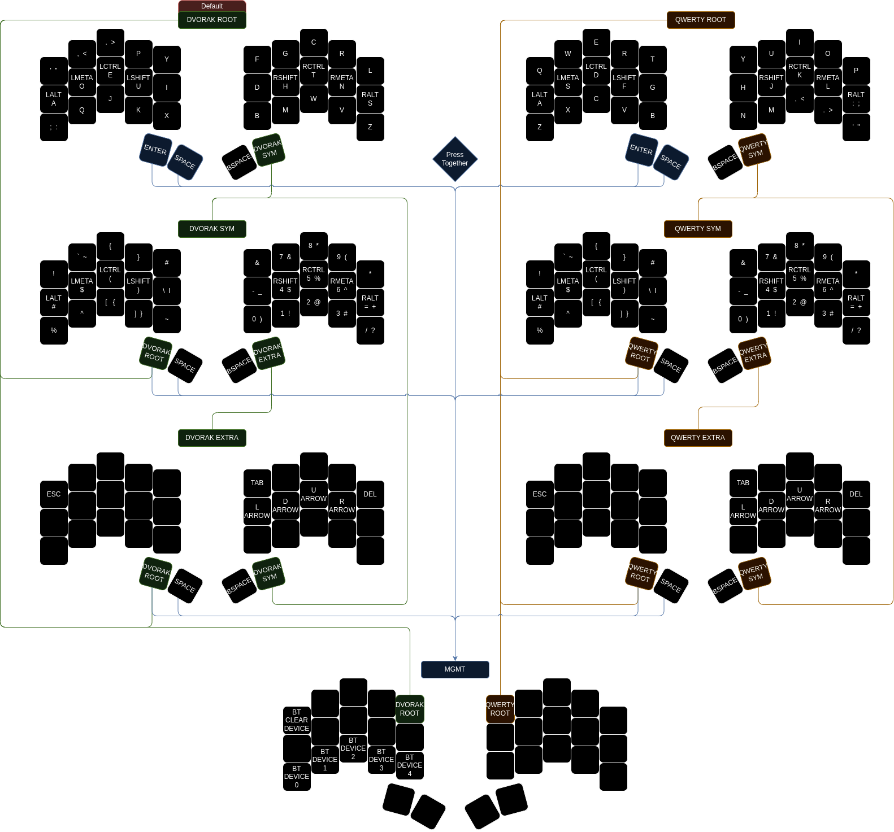

# Ferris Sweep Keymap - ZMK

This is my keymap for my wireless Ferris Sweep.

When first starting, the keyboard will begin in the DVORAK ROOT layer.

If you want to switch to QWERTY, you will need to access the MGMT layer. This can
be accessed from any layer by pressing both thumb cluster keys on the left board.

